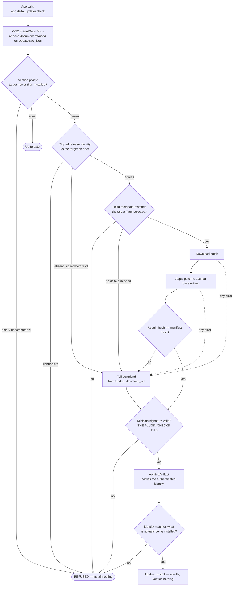

# Architecture

## The problem

Tauri's official updater downloads a complete installer artifact for every
update: an `.AppImage` on Linux, an NSIS `.exe` or `.msi` on Windows, an
`.app.tar.gz` on macOS. A release that changes one line of Rust still ships every
byte of the WebView assets, the bundled runtime, the icons and the vendored
libraries — all of which are already sitting on the user's disk, unchanged.

The waste is proportional to the app size and the release cadence. An app that
ships weekly at 80 MB moves roughly 4 GB per user per year, when the actual
change is usually a fraction of a percent of that.

## The core decision: wrap, don't replace

**This plugin does not implement updating. It implements *making the download
smaller*.**

The obvious design — patch the installed binary in place — is the one to avoid.
It runs straight into the hardest problems in the space:

- On Windows, a running `.exe` is locked; it cannot rewrite itself.
- On macOS, an app bundle is a signed directory tree; touching any byte inside it
  invalidates the code signature and the notarization ticket.
- Any in-place scheme has to be crash-safe against a power cut halfway through
  writing over the user's working application.

So instead of patching what is *installed*, this plugin patches what gets
*downloaded*. The target of the delta is the **installer artifact** — the exact
file the official updater would have fetched over HTTP.

The reconstructed file is byte-for-byte identical to the published artifact. That
identity is the whole trick. It means:

- Tauri's minisign signature over the artifact still validates.
- Tauri's per-platform install logic runs completely unchanged.
- Code signing, notarization and installer behaviour are untouched.
- If the delta path fails for any reason, falling back is trivial: download the
  file normally, exactly as before.

The diff/apply engine is therefore entirely platform-agnostic. It moves bytes
around and has no idea what an AppImage is. The only per-platform work is the
adapter that hands the finished artifact to the installer.

## The flow



Two things in that diagram are easy to get backwards, and both were wrong in
earlier drafts of this document:

- **There is exactly one fetch of the release document.** The delta layer is
  read out of the response `Updater::check()` already made, not fetched
  separately. See `docs/DECISIONS.md` #13 for the downgrade attack the earlier
  two-fetch flow allowed.
- **Tauri does not verify what it is handed.** `Update::install` goes straight
  to the installer; verification lives in `Update::download`, which the delta
  path exists to skip. The signature check in this plugin is therefore the only
  one on this path — see #10.

The identity gate appears twice on purpose. `N` reads the signed comment out of a
document that is still untrusted, so a contradiction is refused before a single
byte is downloaded; that read is **advisory** and can only refuse, never
authorise. `W` is the authoritative one, because it reads
`VerifiedArtifact::binding()`, which cannot exist until `PublicKey::verify`
returned. Every install path passes through `W`. See #27.

Four stages, in order:

1. **Diff** happens at release time, on CI, not on the user's machine. For each
   supported upgrade path (`1.2.0 → 1.3.0`, `1.2.1 → 1.3.0`, …) the release
   tooling produces a patch and records its size and the resulting artifact hash
   in a patch manifest.
2. **Apply** happens on the client: base artifact + patch → rebuilt artifact.
3. **Verify** hashes the rebuilt artifact and compares it against the hash in the
   manifest. This catches a corrupt patch, a corrupt base, a wrong base version
   and a bug in the backend, all with one check.
4. **Handoff** passes the verified file to the platform adapter, which gives it
   to the official updater's install step.

### Where the base artifact comes from

Applying a patch requires the *old official artifact*, and an installed app does
not normally keep the installer it came from. The shipping macOS path therefore
maintains a plugin-owned cache:

1. A verified target artifact is stored as an immutable content-addressed blob
   and recorded as PENDING before installation.
2. `install()` returning `Ok` does not promote it.
3. On a later launch, the plugin compares the running app's compiled-in version
   with PENDING. Only an exact match becomes ACTIVE.
4. ACTIVE is re-hashed and signature-verified against the currently configured
   key every time it is reused.

The first update after adopting the plugin, an install from a website, a cache
miss, and cache corruption therefore take Full. A later compatible update may
use ACTIVE for TarDelta. Cache persistence errors are non-fatal diagnostics:
they cost a future fast path, not the current update.

## The `PatchBackend` trait

Delta algorithms have genuinely different trade-offs — patch size against memory
use against apply speed — and the right one depends on the artifact. The engine
is written against a trait so a backend can be swapped without touching the rest
of the pipeline:

```rust
pub trait PatchBackend: Send + Sync {
    /// Stable identifier recorded in the patch manifest, e.g. "zstd".
    fn id(&self) -> &'static str;

    /// Release-side: produce a patch that turns `old` into `new`.
    fn diff(&self, old: &Path, new: &Path, patch: &Path) -> Result<()>;

    /// Client-side: reconstruct `new` from `old` + `patch`.
    fn apply(&self, old: &Path, patch: &Path, out: &Path) -> Result<()>;
}
```

The manifest records which backend produced each patch, so a client can decline
a patch it cannot apply (and fall back) rather than guessing. That makes adding
a backend a backwards-compatible change.

**Backend 1 — zstd `--patch-from`.** The old artifact is referenced as a
compression *prefix*, with the window log raised to cover its full size, so the
compressor can copy directly from it. Mature, widely deployed, one dependency,
and fast to apply. This is the default.

**Backend 2 — bsdiff (planned).** Produces materially smaller patches for
recompiled binaries because it tolerates the small shifts a recompile causes, at
the cost of much higher memory use during diff. A candidate for release-time use
where CI memory is cheap.

## Per-platform adapter seams

The byte engine is shared, but v0.1 support is deliberately narrower than the
platform-independent tests.

| Platform | Artifact | Notes |
| --- | --- | --- |
| Linux | `.AppImage` | Engine and release fixtures only; no v0.1 client/install support claim. |
| Windows | NSIS `.exe` / `.msi` | CI compilation and engine coverage only; no v0.1 client/install support claim. |
| macOS | `.app.tar.gz` | Supported v0.1 path. The cache expands the old artifact, patches the tar, and exactly reproduces Tauri's gzip write topology before final verification and the real Tauri install. |

## Failure model

Ordinary delta availability failures have exactly one recovery: discard the
candidate and download the complete artifact selected by the same official
Tauri check. This includes missing/corrupt cache entries, unavailable patches,
unknown backends, patch errors, and reconstruction mismatches.

That rule does **not** turn security policy into fallback. A downgrade, an
authenticated identity contradiction, ambiguous platform metadata, or final
signature failure refuses or errors and installs nothing. The high-level API
keeps `Error::Refused` distinct from transport/installation errors, while
successful `Outcome` variants keep Full, DirectDelta, and TarDelta distinct.
Nothing in the delta path panics on malformed or hostile input.

## Public API boundary

The shipping crate exposes `Builder`, `DeltaUpdaterExt`, an opaque checked
`Update`, `Outcome`, `Diagnostic`, progress phases, errors, and advanced local
limits. Engine seams such as `Context`, `InstallHandoff`, transport builders,
cache state, identities, and `VerifiedArtifact` are not application API.

`app.delta_updater().check()` delegates to the official updater once. The opaque
value returned owns that exact `tauri_plugin_updater::Update`; `install()`
derives identity from it and hands verified bytes back through the same object.
There is no public constructor or second installer parameter to mismatch.
The alternatives and Rust-first v0.1 decision are recorded in
[`DECISIONS.md` #34](DECISIONS.md#34-the-plugin-owns-the-ordinary-update-flow).

The repository's low-level harness seams and localhost relaxation are available
only behind the non-default `test-support` feature. The normal example and
normal plugin build contain neither.

## Security notes

- **The hash check is a correctness gate, not the trust anchor.** Authenticity
  comes from the minisign signature over the target installer. A patch is
  untrusted input; it is only ever used to produce a candidate file that must
  then pass both checks.
- **Artifact authenticity is not manifest authenticity.** The signature proves
  the *bytes* came from the holder of the signing key. It covers no manifest
  field — not the version, the URLs, the sizes or the digests — because the
  release document is **not signed at all**. Anything in this repository that
  reads as though the manifest were authenticated is a bug in the prose; see
  `docs/DECISIONS.md` #11.
- **The release identity, however, *is* authenticated — inside the signature.**
  Minisign blocks carry a trusted comment covered by a second signature over
  `artifact_sig ‖ trusted_comment`, checked by the same `PublicKey::verify` this
  plugin already calls. The release process writes
  `delta-v1 app:… v:… plat:… rep:… b3:… sz:… ts:…` there, and the client compares
  every field against what it is installing. So "these bytes are ours" became
  "these bytes are ours, and they are version X of application Y for platform Z".
  A contradiction fails closed and never falls back; a release signed before this
  existed keeps working with the delta paths unavailable. See #27.
- **Authenticity, identity and freshness are three separate properties.** The
  first two are held. **Freshness is not**: nothing proves the release on offer is
  the newest published, so a genuine older release carrying its own genuine
  identity is stopped only by version policy against an existing install, and not
  at all on a first install. There is no expiry, timestamp authority or role
  separation here. Do not read this as TUF-style freshness.
- **The release is bound to the one Tauri checked.** Because a signature says
  nothing about *which* release it covers, and old signatures stay valid
  forever, signature verification alone cannot stop a downgrade to a genuinely
  signed vulnerable version. An explicit version policy does, and the delta
  metadata is bound to Tauri's own selected target and signature so the two
  cannot describe different releases. See #13 and #14.
- **The plugin performs the signature check itself, and must.** This was
  originally written assuming Tauri would verify whatever it was handed. It does
  not. In `tauri-plugin-updater` 2.10.1, `verify_signature` is called from
  exactly one place — inside `Update::download()` — and the handoff seam,
  `Update::install(bytes)`, goes straight to the installer with no verification.
  Since the delta path exists precisely to avoid `download()`, nothing would
  check the signature unless the plugin does. It therefore runs the check before
  every handoff, using Tauri's own verification code reproduced verbatim and
  pinned by `tauri_signature_compat.rs`. Skipping it would turn the delta path
  into a way to install unsigned artifacts, which is the one outcome this design
  exists to prevent.
- **Patches are treated as hostile.** Apply streams its output to disk and stops
  at a configurable ceiling, so a malicious patch cannot expand indefinitely or
  fill the user's disk.
- **Allocation is bounded before decompression starts.** The manifest declares
  the target installer's exact size, so the window zstd may allocate is derived
  from a number the release committed to in advance rather than from the patch's
  own header. A patch claiming a huge window log is rejected during frame setup.
- **That declared size is itself bounded.** The manifest is unauthenticated, so
  its size claim is a request rather than a fact — a document asking for 500 GB
  would otherwise be obeyed because it asked. `Limits::max_target_bytes` is the
  host's own ceiling, checked before any download, and it is the only one of the
  two the update server cannot influence. See `docs/DECISIONS.md` #19.
- **And so is every other stage.** The tar layer is a pipeline, and each arrow in
  it has a server-declared size that goes on to bound real work:

  ```text
  cached .app.tar.gz -> base tar -> + patch -> target tar -> installer
    max_blob_bytes    max_tar_bytes  max_response  max_tar_bytes  max_target_bytes
     (CacheLimits)     (CacheLimits)  (HttpFetch)    (Limits)       (Limits)
  ```

  The ceilings are **independent dials rather than one number and a ratio**,
  because gzip and patch application both expand without bound, so a cap derived
  from an earlier stage inherits the unboundedness it was meant to remove. A
  declared size may only ever *lower* the effective bound, never raise it. See
  #29.
- **The cache is hostile input in both directions.** Reading re-checks kind,
  size, digest and signature against the key configured *now*. Writing confirms
  that an already-occupied content address holds a regular file of the right
  length, rather than inferring a stored blob from a taken name — see #30 for
  why that distinction is worth a syscall.
- **Concurrent updates share nothing but a directory name.** Every path — full,
  delta and tar-delta — works inside a `tempfile` workspace whose name comes from
  OS randomness, so two updates cannot reach each other's files even mid-write.
  Workspaces abandoned by a crashed process are swept after a day. See #18, #28
  and #31.
- **Untrusted tar structure is walked, never extracted.** Recompression reads
  entry headers to replay write boundaries, using a fixed 512-byte header buffer
  and an 8 KB payload buffer, with every entry bounded by the bytes the archive
  has left. Nothing is written to a path the archive names, so the tar cannot
  address anything outside the file being rebuilt.
- **No new network surface.** The plugin fetches from the update server the app
  already configures, and sends no telemetry.
- **Patch metadata cannot redirect application credentials.** Headers inherited
  from Tauri are attached only to the exact authoritative full-artifact URL.
  Patch URLs come from additional unauthenticated fields and never receive those
  headers, even when they share the same update document.

## The manifest

Release-time output is a single `manifest.json` that is **a superset of Tauri's
own static updater document**. Tauri's `version`, `notes`, `pub_date` and
`platforms` fields are present and untouched; delta information lives under a
separate `delta` key.

That shape is deliberate. Publishing a second, delta-specific document would mean
two files that have to agree about URLs, versions and signatures while being
written by different code paths — and the drift shows up exactly when it hurts
most, in the fallback. One document cannot disagree with itself.

```
manifest.json
├── version, notes, pub_date          ── read by every Tauri client
├── platforms/<os-arch>/{url,signature}  ── the full-download fallback
└── delta/
    ├── schema, hash_algo
    └── platforms/<os-arch>/
        ├── target_version
        ├── target_installer_blake3   ── the reconstruction gate
        ├── target_installer_size     ── bounds allocation before decompressing
        ├── signature                 ── same value as the Tauri layer
        └── patches/<from_version>/{backend_id, patch_url, patch_blake3, patch_size}
```

Three properties worth stating explicitly:

- **The signature is over the target installer, never the patch.** Both paths end
  up holding the same artifact, so one signature validates both, and the delta
  path cannot install anything the full-download path would have refused.
- **Hashes name their algorithm.** Fields are `*_blake3` and `hash_algo` is
  explicit, so a client refuses a document it cannot check rather than comparing
  a BLAKE3 digest against a field that once held SHA-256.
- **Schema 1 patches only to the latest release.** One patch per update, never a
  chain. The `schema` field lets an older client decline a format it does not
  implement instead of misreading it.

## The release side

`delta-release` is file-in, file-out: previous installer plus new installer
produces the patch, the digests, the signature and the manifest. It runs on CI
once per release, never on a user's machine, and needs no network access — which
also makes it runnable by hand against two local files.

Because the engine and the tooling are tested against the identical fixtures, the
loop is closed in CI: a manifest generated by the real tool is handed to a
simulated client with nothing else, and the client has to reach a verified
artifact using only what the manifest recorded.

## What this plugin deliberately does not do

- Patch installed binaries in place.
- Replace, fork or vendor `tauri-plugin-updater`.
- Change how artifacts are signed, verified or installed.
- Require a particular hosting setup — the patch manifest is a static JSON file
  and can sit next to the existing update endpoint.
