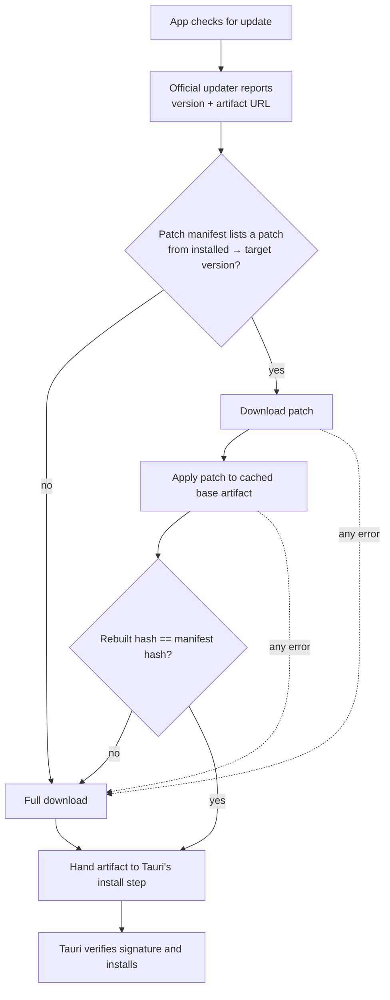

# Architecture

## The problem

Tauri's official updater downloads a complete installer artifact for every
update: an `.AppImage` on Linux, an NSIS `.exe` or `.msi` on Windows, an
`.app.tar.gz` on macOS. A release that changes one line of Rust still ships every
byte of the WebView assets, the bundled runtime, the icons and the vendored
libraries — all of which are already sitting on the user's disk, unchanged.

The waste is proportional to the app size and the release cadence. An app that
ships weekly at 80 MB moves roughly 4 GB per user per year, when the actual
change is usually a fraction of a percent of that.

## The core decision: wrap, don't replace

**This plugin does not implement updating. It implements *making the download
smaller*.**

The obvious design — patch the installed binary in place — is the one to avoid.
It runs straight into the hardest problems in the space:

- On Windows, a running `.exe` is locked; it cannot rewrite itself.
- On macOS, an app bundle is a signed directory tree; touching any byte inside it
  invalidates the code signature and the notarization ticket.
- Any in-place scheme has to be crash-safe against a power cut halfway through
  writing over the user's working application.

So instead of patching what is *installed*, this plugin patches what gets
*downloaded*. The target of the delta is the **installer artifact** — the exact
file the official updater would have fetched over HTTP.

The reconstructed file is byte-for-byte identical to the published artifact. That
identity is the whole trick. It means:

- Tauri's minisign signature over the artifact still validates.
- Tauri's per-platform install logic runs completely unchanged.
- Code signing, notarization and installer behaviour are untouched.
- If the delta path fails for any reason, falling back is trivial: download the
  file normally, exactly as before.

The diff/apply engine is therefore entirely platform-agnostic. It moves bytes
around and has no idea what an AppImage is. The only per-platform work is the
adapter that hands the finished artifact to the installer.

## The flow



Four stages, in order:

1. **Diff** happens at release time, on CI, not on the user's machine. For each
   supported upgrade path (`1.2.0 → 1.3.0`, `1.2.1 → 1.3.0`, …) the release
   tooling produces a patch and records its size and the resulting artifact hash
   in a patch manifest.
2. **Apply** happens on the client: base artifact + patch → rebuilt artifact.
3. **Verify** hashes the rebuilt artifact and compares it against the hash in the
   manifest. This catches a corrupt patch, a corrupt base, a wrong base version
   and a bug in the backend, all with one check.
4. **Handoff** passes the verified file to the platform adapter, which gives it
   to the official updater's install step.

### Where the base artifact comes from

Applying a patch requires the *old* artifact, and an installed app does not
normally keep the installer it came from. Two strategies, both planned:

- **Cache the artifact** after an update completes, so the next update has its
  base ready. Cheap, but useless for the very first delta update and for anyone
  who installed from the website.
- **Reconstruct the base** from what is on disk where the installed layout allows
  it deterministically.

Until a base is available, the plugin simply does a full download. The design
never assumes the base is present.

## The `PatchBackend` trait

Delta algorithms have genuinely different trade-offs — patch size against memory
use against apply speed — and the right one depends on the artifact. The engine
is written against a trait so a backend can be swapped without touching the rest
of the pipeline:

```rust
pub trait PatchBackend: Send + Sync {
    /// Stable identifier recorded in the patch manifest, e.g. "zstd".
    fn id(&self) -> &'static str;

    /// Release-side: produce a patch that turns `old` into `new`.
    fn diff(&self, old: &Path, new: &Path, patch: &Path) -> Result<()>;

    /// Client-side: reconstruct `new` from `old` + `patch`.
    fn apply(&self, old: &Path, patch: &Path, out: &Path) -> Result<()>;
}
```

The manifest records which backend produced each patch, so a client can decline
a patch it cannot apply (and fall back) rather than guessing. That makes adding
a backend a backwards-compatible change.

**Backend 1 — zstd `--patch-from`.** The old artifact is referenced as a
compression *prefix*, with the window log raised to cover its full size, so the
compressor can copy directly from it. Mature, widely deployed, one dependency,
and fast to apply. This is the default.

**Backend 2 — bsdiff (planned).** Produces materially smaller patches for
recompiled binaries because it tolerates the small shifts a recompile causes, at
the cost of much higher memory use during diff. A candidate for release-time use
where CI memory is cheap.

## Per-platform adapter seams

Everything above is shared. Per-platform code is confined to one small trait: how
to obtain the base artifact, and how to hand the rebuilt one to the installer.

| Platform | Artifact | Notes |
| --- | --- | --- |
| Linux | `.AppImage` | Simplest case: a single self-contained file, no installer step, no code signature to preserve. This is why it is the first target — and why the engine can be proven on macOS, since round-tripping an AppImage is just file I/O. |
| Windows | NSIS `.exe` / `.msi` | Artifact is a single file. Handoff means pointing the existing installer-launch step at the rebuilt file. |
| macOS | `.app.tar.gz` | Compressed tarball, so unrelated changes perturb the compressed stream widely. Likely needs the delta taken against the *uncompressed* tar and the gzip layer reproduced deterministically — the hardest of the three, hence last. |

## Failure model

The safety property is: **the delta path can only ever make an update faster,
never make it fail.**

Every step from manifest lookup to hash verification is fallible and every
failure has exactly one recovery: discard whatever the delta path produced and
let the official updater do a full download. There is no error state in which the
user is left worse off than if this plugin were not installed.

`delta_core::Error` is `#[non_exhaustive]` and every variant is treated as
recoverable at the plugin boundary. Nothing in the delta path panics on
malformed or hostile input.

## Security notes

- **The hash check is a correctness gate, not the trust anchor.** Authenticity
  comes from the signature over the release manifest and from Tauri's minisign
  check on the artifact. A patch is untrusted input; it is only ever used to
  produce a candidate file that must then pass both checks.
- **Patches are treated as hostile.** Decompression output is bounded so a
  malicious patch cannot force an unbounded allocation or fill the disk.
- **No new network surface.** The plugin fetches from the update server the app
  already configures, and sends no telemetry.

## What this plugin deliberately does not do

- Patch installed binaries in place.
- Replace, fork or vendor `tauri-plugin-updater`.
- Change how artifacts are signed, verified or installed.
- Require a particular hosting setup — the patch manifest is a static JSON file
  and can sit next to the existing update endpoint.
